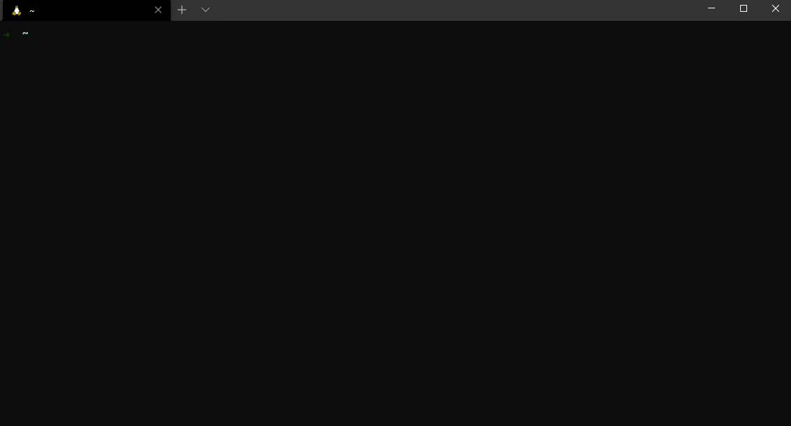

```
####    ###
####   #####
####    ###                        ##
 ####                              ##
 ####  #####                      #####
 ####  #####                      #####
 ####   ###                        ##
 ####   ###                        ##
 ####   ###    ###  ##       ###   ##      ##   ##
 ####   ###   ##### ######  #####  ##     ####  ######
 ####   ###  ##  ## ##  ## ##  ##  ##    ##  ## ##  ##
 ####   ###  ##  ## ##  ## ##  ##  ##    ##  ## ##
 ####   ###  ##  ## ##  ## ##  ##  ##    ##  ## ##
  ####  ###  ##  ## ##  ## ##  ##  ##    ##  ## ##
  #### #####  ##### ##  ##  #####   ####  ####  ##
  #### #####   #### ##  ##   ####   ####   ##   ##
                 ##
             ##  ##
             ######
              ###

------------------------------------------------------
       S T R U C T U R E D  R A N D O M N E S S
------------------------------------------------------
```

 

## Log generation made simple

lignator (Latin for lumberjack) is a cli tool to generate structured but randomized outputs. It was originally created for generating event logs to help test Splunk clusters at scale, but as it has evolved we are seeing it being used to generate other randomized structures such as SQL queries, CSV or json. Make sure you check out the examples for some ideas and feel free to contribute some new ones.



- [Getting started](#1-getting-started)
- [How it works](/docs/2.how_it_works.md)
- [Inputs](/docs/3.input.md)
- [Output](/docs/4.output.md)
- [Options](/docs/5.options.md)
- [Tokens](/docs/6.tokens.md)
- [Considerations](/docs/7.considerations.md)


# 1. Getting Started

Head over to [releases](https://github.com/JimPaine/lumberjack/releases) and grab the latest version, all the details on how to install it will be in the release notes.

# Contributing

This project welcomes contributions and suggestions.  Most contributions require you to agree to a
Contributor License Agreement (CLA) declaring that you have the right to, and actually do, grant us
the rights to use your contribution. For details, visit https://cla.opensource.microsoft.com.

When you submit a pull request, a CLA bot will automatically determine whether you need to provide
a CLA and decorate the PR appropriately (e.g., status check, comment). Simply follow the instructions
provided by the bot. You will only need to do this once across all repos using our CLA.

This project has adopted the [Microsoft Open Source Code of Conduct](https://opensource.microsoft.com/codeofconduct/).
For more information see the [Code of Conduct FAQ](https://opensource.microsoft.com/codeofconduct/faq/) or
contact [opencode@microsoft.com](mailto:opencode@microsoft.com) with any additional questions or comments.

# Trademarks

This project may contain trademarks or logos for projects, products, or services. Authorized use of Microsoft
trademarks or logos is subject to and must follow
[Microsoft's Trademark & Brand Guidelines](https://www.microsoft.com/en-us/legal/intellectualproperty/trademarks/usage/general).
Use of Microsoft trademarks or logos in modified versions of this project must not cause confusion or imply Microsoft sponsorship.
Any use of third-party trademarks or logos are subject to those third-party's policies.
